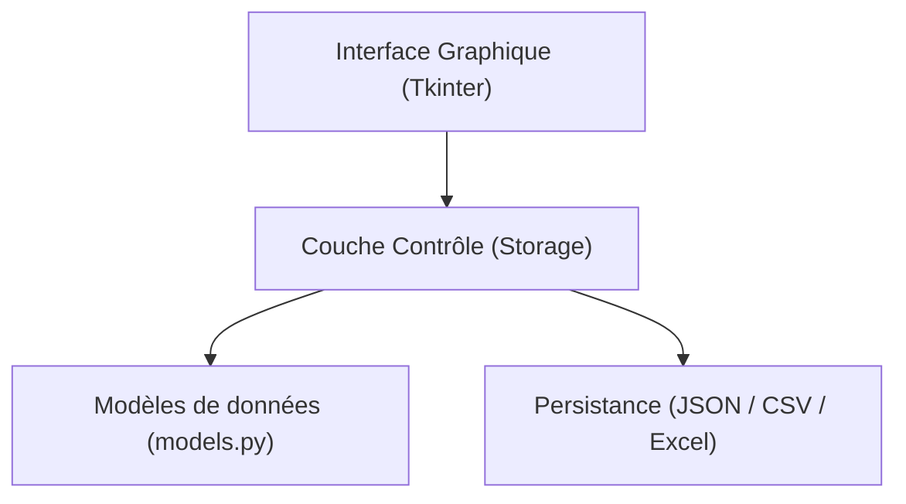
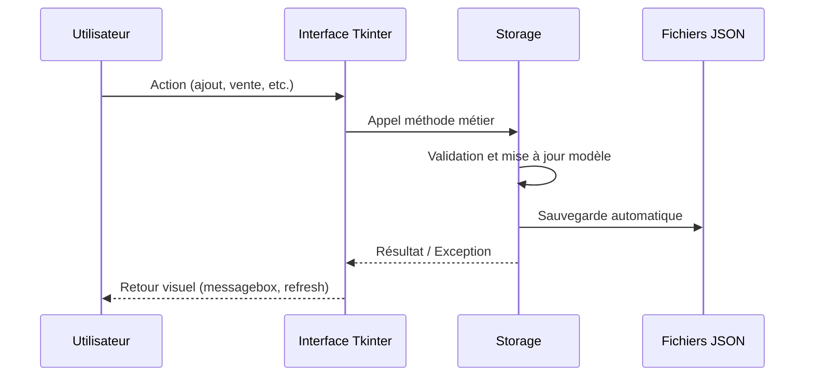
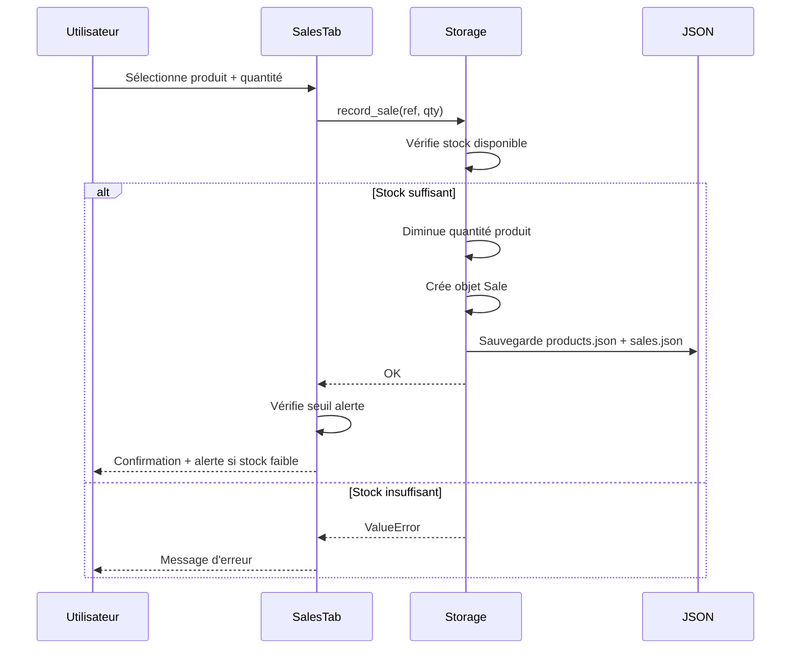
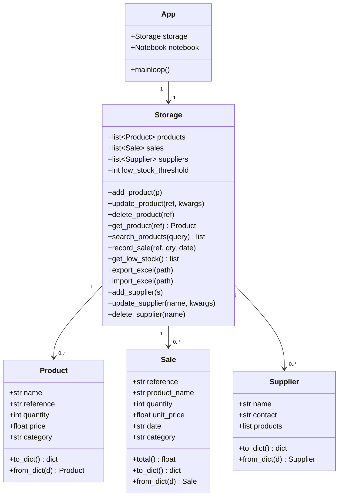

# Architecture — OpenInventory

## Vue d'ensemble en couches



## Arborescence du projet

```
OpenInventory/
├── main.py
├── models.py
├── storage.py
├── data/
│   ├── products.json
│   ├── sales.json
│   └── suppliers.json
└── gui/
    ├── app.py
    ├── products_tab.py
    ├── sales_tab.py
    ├── reports_tab.py
    ├── suppliers_tab.py
    └── dialogs.py
```

## Flux de données



## Flux spécifique — Enregistrement d'une vente



## Diagramme de classes



## Gestion des erreurs

| Situation | Exception levée | Traitement GUI |
|---|---|---|
| Référence produit dupliquée | `ValueError` | `messagebox.showerror` |
| Produit non trouvé | `KeyError` | `messagebox.showerror` |
| Stock insuffisant pour vente | `ValueError` | `messagebox.showerror` |
| Champ requis manquant | `ValueError` | `messagebox.showwarning` |
| Fichier JSON corrompu | `json.JSONDecodeError` | Réinitialisation à vide |
| Fichier Excel invalide | `Exception` | `messagebox.showerror` |
