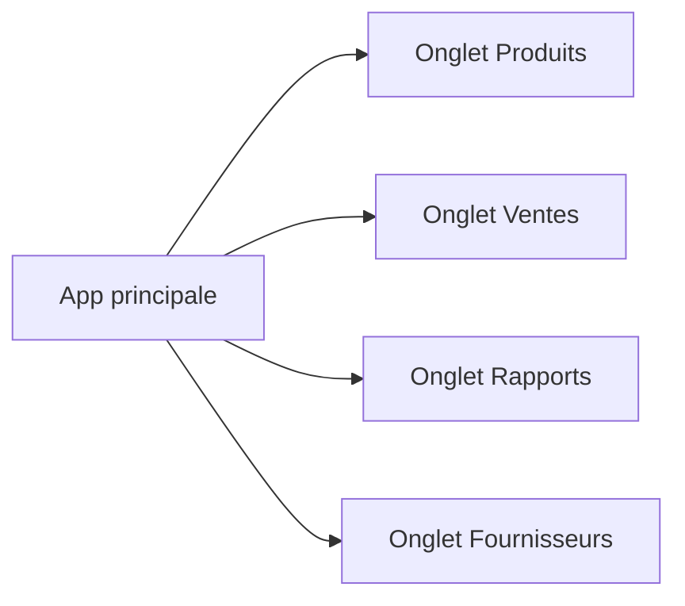
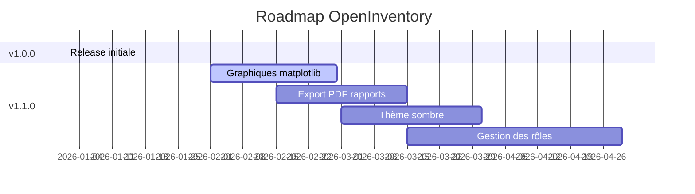

# Notes de release — OpenInventory v1.0.0

**Date de publication :** 2026-01-01
**Tag Git :** `v1.0.0`
**Auteurs :** astro-sensei & contributeurs

---

## Résumé

Première version stable d'OpenInventory, application de gestion des stocks pour petites entreprises. Cette release couvre l'intégralité du cahier des charges initial.

---

## Nouveautés

### Interface graphique (Tkinter)



### Gestion des produits
- ✅ Ajout avec référence unique, nom, quantité, prix, catégorie
- ✅ Modification et suppression
- ✅ Recherche par nom ou référence
- ✅ Tri par catégorie ou par quantité

### Suivi des ventes
- ✅ Enregistrement d'une vente avec date
- ✅ Mise à jour automatique du stock
- ✅ Rapport : produits les plus vendus, CA total, filtrage par période

### Rapports
- ✅ Produits les plus/moins en stock
- ✅ CA par catégorie de produit
- ✅ Ventes filtrées par période

### Persistance
- ✅ Sauvegarde automatique JSON après chaque opération
- ✅ Chargement au démarrage
- ✅ Import / Export Excel (`.xlsx`)

### Alertes
- ✅ Notification automatique si stock ≤ seuil (défaut : 5 unités)

### Fournisseurs
- ✅ Gestion complète (ajout, modification, suppression)
- ✅ Association de références produits à chaque fournisseur

---

## Fichiers inclus

| Fichier | Description |
|---|---|
| `main.py` | Point d'entrée |
| `models.py` | Modèles Product, Sale, Supplier |
| `storage.py` | Couche métier et persistance |
| `gui/app.py` | Fenêtre principale |
| `gui/products_tab.py` | Onglet Produits |
| `gui/sales_tab.py` | Onglet Ventes |
| `gui/reports_tab.py` | Onglet Rapports |
| `gui/suppliers_tab.py` | Onglet Fournisseurs |
| `gui/dialogs.py` | Fenêtres de dialogue |

---

## Dépendances

| Bibliothèque | Version minimale | Usage |
|---|---|---|
| Python | 3.10+ | Langage |
| tkinter | stdlib | Interface graphique |
| openpyxl | 3.1+ | Import/Export Excel |
| json | stdlib | Persistance |
| datetime | stdlib | Gestion des dates |

---

## Installation rapide

```bash
git clone https://github.com/astro-sensei/OpenInventory.git
cd OpenInventory
pip install openpyxl
python main.py
```

---

## Limitations connues

- Pas de gestion multi-utilisateurs
- Pas d'authentification
- Les graphiques statistiques ne sont pas encore intégrés (prévu v1.1.0)
- L'import Excel ne traite que la feuille nommée exactement **Produits**

---

## Roadmap v1.1.0


