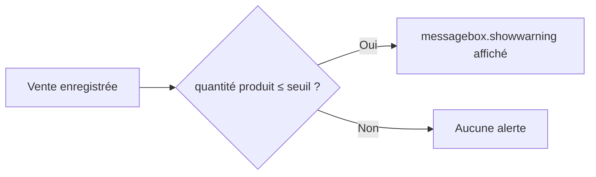
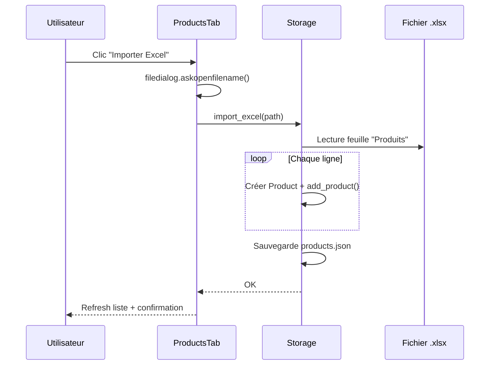

# Documentation Technique — OpenInventory v1.0.0

## Stack technique

| Composant | Technologie |
|---|---|
| Langage | Python 3.13 |
| Interface graphique | Tkinter (ttk) |
| Persistance | JSON (stdlib) |
| Export/Import | openpyxl |
| Modèles | dataclasses (stdlib) |
| Dates | datetime (stdlib) |

---

## Module `models.py`

### `Product`

```python
@dataclass
class Product:
    name: str
    reference: str
    quantity: int
    price: float
    category: str
```

| Méthode | Retour | Description |
|---|---|---|
| `to_dict()` | `dict` | Sérialisation |
| `from_dict(d)` | `Product` | Désérialisation |

### `Sale`

```python
@dataclass
class Sale:
    reference: str
    product_name: str
    quantity: int
    unit_price: float
    date: str
    category: str
```

| Propriété/Méthode | Retour | Description |
|---|---|---|
| `total` | `float` | `quantity × unit_price` |
| `to_dict()` | `dict` | Sérialisation |
| `from_dict(d)` | `Sale` | Désérialisation |

### `Supplier`

```python
@dataclass
class Supplier:
    name: str
    contact: str
    products: List[str]
```

---

## Module `storage.py`

### Classe `Storage`

#### Constructeur

```python
Storage(
    products_file="data/products.json",
    sales_file="data/sales.json",
    suppliers_file="data/suppliers.json",
    low_stock_threshold=5
)
```

#### Méthodes Produits

| Méthode | Signature | Exception | Description |
|---|---|---|---|
| `add_product` | `(p: Product) -> None` | `ValueError` si ref dupliquée | Ajoute et sauvegarde |
| `update_product` | `(ref: str, **kwargs) -> None` | `KeyError` si non trouvé | Met à jour les champs |
| `delete_product` | `(ref: str) -> None` | `KeyError` si non trouvé | Supprime et sauvegarde |
| `get_product` | `(ref: str) -> Product` | `KeyError` si non trouvé | Récupère par référence |
| `search_products` | `(query: str) -> list[Product]` | — | Recherche nom ou ref |

#### Méthodes Ventes

| Méthode | Signature | Exception | Description |
|---|---|---|---|
| `record_sale` | `(ref: str, qty: int, date: str) -> Sale` | `ValueError` si stock insuffisant | Enregistre vente + màj stock |
| `get_sales_report` | `() -> dict` | — | Stats globales des ventes |

#### Méthodes Fournisseurs

| Méthode | Signature | Exception | Description |
|---|---|---|---|
| `add_supplier` | `(s: Supplier) -> None` | `ValueError` si nom dupliqué | Ajoute fournisseur |
| `update_supplier` | `(name: str, **kwargs) -> None` | `KeyError` si non trouvé | Met à jour |
| `delete_supplier` | `(name: str) -> None` | `KeyError` si non trouvé | Supprime |

#### Import / Export Excel

| Méthode | Signature | Description |
|---|---|---|
| `export_excel` | `(path: str) -> None` | Exporte produits, ventes, fournisseurs dans 3 feuilles |
| `import_excel` | `(path: str) -> None` | Importe la feuille "Produits" |

---

## Format des fichiers JSON

### `products.json`

```json
[
  {
    "name": "Café Arabica",
    "reference": "CAF001",
    "quantity": 120,
    "price": 8.50,
    "category": "Alimentaire"
  }
]
```

### `sales.json`

```json
[
  {
    "reference": "CAF001",
    "product_name": "Café Arabica",
    "quantity": 10,
    "unit_price": 8.50,
    "date": "2026-01-15",
    "category": "Alimentaire"
  }
]
```

### `suppliers.json`

```json
[
  {
    "name": "FournisseurPro",
    "contact": "contact@fournisseurpro.fr",
    "products": ["CAF001", "THE002"]
  }
]
```

---

## Format du fichier Excel exporté

| Feuille | Colonnes |
|---|---|
| Produits | Nom, Référence, Quantité, Prix unitaire, Catégorie |
| Ventes | Référence, Produit, Quantité, Prix unitaire, Total, Date, Catégorie |
| Fournisseurs | Nom, Contact, Produits fournis |

---

## Seuil d'alerte stock faible

Le seuil par défaut est `5`. Il est configurable dans `Storage.__init__()`.



---

## Diagramme de séquence — Import Excel


